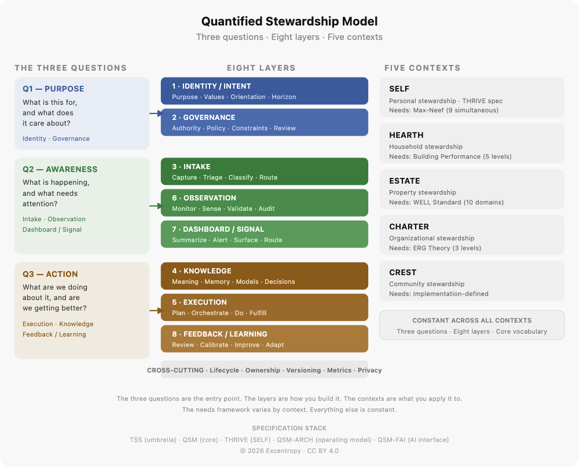

# Quantified Stewardship — Conceptual Overview
**Document type:** Conceptual overview (Layer 1 — human and agent entry point)  
**Applies to:** The full stewardship stack — QSM, THRIVE, TSS, QSM-FAI, QSM-ARCH  
**Version:** 1.0  
**Read this before:** Any other document in this specification package  
**Maintainer:** Caitlin · Excentropy  
**License:** CC BY 4.0

---

## What is quantified stewardship?

Stewardship is the sustained, responsible management of something you care for on behalf of yourself, others, or the future. It is not just task completion. A steward pays attention to what matters, tracks what is happening, makes decisions with appropriate authority, and learns from what they observe over time.

Most people already do this — for their health, their home, their finances, their teams. What they rarely have is a consistent structure for doing it across all the different things they are responsible for. As a result, things fall through the cracks, decisions get made without full context, and the same problems recur because no one is holding the system.

The Quantified Stewardship Model (QSM) provides that structure. It is a domain-agnostic framework for representing what you are responsible for, what those responsibilities require, how decisions get made, and whether you are doing well. It is designed to work for a single person managing their life, a household, a property portfolio, an organization, or a community — using the same underlying logic across all of them.

*Quantified* does not mean everything is a number. It means stewardship is made explicit, visible, and assessable rather than implicit and invisible.

---

## At a glance



*The diagram summarizes the model: three orienting questions, eight implementation layers, five context types (each with its own needs framework), cross-cutting planes, and the specification stack below.*

---

## The three questions

Every stewardship system — regardless of scale, context, or complexity — is trying to answer three questions. These questions are the conceptual core of QSM. If you understand them, you understand the system.

---

### Question 1 — What is this for, and what does it care about?

Before anything else, a stewardship context needs to declare its purpose and its values. What is being managed? For whom? What matters most, and what is non-negotiable? What decisions can be made at what level, by whom?

Without a clear answer to this question, the rest of the system is task execution in service of unstated purposes. Over time, that produces drift — doing things efficiently without being sure why they matter.

*This question is answered by:* the context declaration, **IdentityIntentProfile** (for SELF contexts), governance rules, and declared values and priorities.

---

### Question 2 — What is happening, and what needs attention?

A running stewardship system needs to know its current state. What signals are arriving? What is the status of things being managed? What is overdue, degraded, at risk, or newly arrived? What requires a decision or an action?

This is the real-time awareness layer. It is not just about problems — it includes positive signals, completed work, and the routine pulse of a healthy system. The goal is legibility: anyone responsible for the context should be able to look and understand what is going on without digging for information.

*This question is answered by:* intake and capture processes, observation and monitoring, and the dashboard and signal layer.

---

### Question 3 — What are we doing about it, and are we getting better?

Acting on what is known, and learning from the results. This includes the work of stewardship — the tasks, routines, decisions, and interventions that keep things functioning — and the reflection that turns experience into improvement. A system that acts but does not learn will keep repeating the same responses to the same problems. A system that learns but does not act accumulates insight without effect.

*This question is answered by:* the execution layer, the knowledge and memory layer, and the feedback and learning layer.

---

## The five context types

QSM is designed to be applied across five distinct types of stewardship context. Each context has a different subject — a different thing being stewarded — and therefore uses different frameworks for assessing needs, different management categories, and different roles.

The underlying structure (the three questions, the layer model, the governance rules) is the same across all five. What varies is the vocabulary used to fill it.

---

### SELF — Personal stewardship

**What is being stewarded:** A person's own capacity, wellbeing, functioning, and development.

The SELF context treats the person as a stewardship domain. This is not about productivity optimization. It is about sustaining the conditions under which a person can function, recover, and flourish — while carrying their obligations to others. A person managing their own executive function, health, finances, relationships, digital life, and sense of purpose is doing SELF stewardship.

The SELF context is governed by **THRIVE v1.1.0**, which provides the structures for capacity, load, routines, recovery, and the human dimensions of self-management.

The needs framework for SELF is **Max-Neef's taxonomy of fundamental human needs** — nine simultaneous, non-hierarchical needs (Subsistence, Protection, Affection, Understanding, Participation, Leisure, Creation, Identity, Freedom) that are always present and served by different satisfiers depending on the person and their context.

THRIVE v1.1.0 also requires SELF implementations to declare **world domains** — the physical (body, space, health), digital (attention, data, tools, online presence), and metaphysical (meaning, values, inner life) arenas in which a person is actively being stewarded. Developmental context and temporal cycles modify how capacity and satisfiers are interpreted over time; they do not change which fundamental needs are present.

---

### HEARTH — Household stewardship

**What is being stewarded:** A shared living space and the people, systems, and relationships within it.

The HEARTH context covers household coordination — home maintenance, shared finances, caregiving arrangements, domestic routines, and the logistics of shared life. It may be managed by a single person or shared across a partnership. The unit of analysis is the household as a functioning system, not the individuals in it (those are SELF contexts nested within it).

The needs framework for HEARTH is the **Building Performance Hierarchy** — a five-level model treating the home as a functional system where physical integrity and safety must be established before comfort and responsiveness can be meaningfully addressed.

---

### ESTATE — Property stewardship

**What is being stewarded:** A property or portfolio of properties, with their physical systems, occupants, finances, and obligations.

The ESTATE context covers property management at a level of complexity beyond a primary household — multiple units, tenants or occupants, vendor relationships, compliance requirements, and investment considerations. The steward is accountable not just for the physical condition of the property but for the health and experience of people who live or work in it.

The needs framework for ESTATE is the **WELL Building Standard** — ten parallel domains (Air, Water, Nourishment, Light, Movement, Thermal Comfort, Sound, Materials, Mind, Community) that operate simultaneously and treat the built environment as a health-delivery system.

---

### CHARTER — Organizational stewardship

**What is being stewarded:** An organization, team, or enterprise — its mission, people, operations, and resources.

The CHARTER context applies to any bounded organization with a declared mission, defined roles, and operational responsibilities. This includes nonprofits, companies, teams within larger organizations, and founder-led ventures. The steward is accountable to the mission, to the people doing the work, and to those the organization serves.

The needs framework for CHARTER is **Alderfer's ERG Theory** — three levels (Existence, Relatedness, Growth) that can be active simultaneously and acknowledge that when higher-level needs are blocked, people and systems regress to lower-level concerns. This is more realistic than Maslow in organizational settings.

---

### CREST — Community stewardship

**What is being stewarded:** A community or collective — shared resources, governance structures, membership, and common purpose.

The CREST context applies to communities managing shared assets, making collective decisions, and sustaining participation over time. This includes neighborhood associations, cooperatives, online communities, and civic collectives. Stewardship in this context is inherently distributed — authority is shared, not held by a single steward.

The needs framework for CREST is implementation-defined. Communities vary too much in structure and purpose for a universal framework to apply. A conformant implementation must declare its chosen framework.

### Needs frameworks by context

| Context | Needs framework | Character |
|---|---|---|
| SELF | Max-Neef (9 simultaneous) | Non-hierarchical; needs are universal, satisfiers are personal |
| HEARTH | Building Performance (5 levels) | Systems-based; sequential hierarchy |
| ESTATE | WELL Standard (10 domains) | Parallel domains; breadth-based |
| CHARTER | ERG (3 levels) | Quasi-hierarchical; simultaneous activation allowed |
| CREST | Implementation-defined | No universal default |

---

## The specification stack

The stewardship stack is a set of five coordinated specifications. They are not alternatives to each other — they stack, with each document adding a specific layer of structure.

```
┌─────────────────────────────────────────────────────┐
│  TSS v1.1.1 — Stewardship Standard                  │
│  Normative umbrella. Governs all other specs.        │
│  Defines conformance, audit, and change control.     │
├─────────────────────────────────────────────────────┤
│  QSM v1.0.1 — Core Model                            │
│  Ontology and stewardship logic.                     │
│  Context types, entities, roles, needs, actions.    │
├────────────────────┬────────────────────────────────┤
│  THRIVE v1.1.0     │  (Future: HEARTH, ESTATE,     │
│  SELF context      │   CHARTER, CREST specs)         │
│  layer spec        │                                 │
├────────────────────┴────────────────────────────────┤
│  QSM-ARCH v1.0 — Operating Model                    │
│  Eight layers, engines, cross-cutting planes.        │
│  How QSM implementations are structured.             │
├─────────────────────────────────────────────────────┤
│  QSM-FAI v1.0.1 — Fiduciary AI Interface            │
│  Rules for AI agents acting within the stack.        │
│  Protects context, capacity, and human authority.    │
└─────────────────────────────────────────────────────┘
```

**Which specification to read for which purpose:**

| If you want to… | Read… |
|---|---|
| Orient to the full model (start here) | QSM-OVERVIEW v1.0 (this document) |
| Understand the overall stewardship model | QSM v1.0.1 |
| Implement personal stewardship (SELF context) | THRIVE v1.1.0 |
| Understand the full operating architecture | QSM-ARCH v1.0 |
| Build a conformant AI agent for this system | QSM-FAI v1.0.1 |
| Understand audit, governance, and change control | TSS v1.1.1 |
| Implement a different context type | QSM v1.0.1 + this overview |

TSS is the normative authority — when specifications conflict, TSS governs. QSM is the conceptual foundation everything else builds on. Context-specific specs (THRIVE and future equivalents) depend on both.

---

## The operating model

QSM implementations are structured as eight layers. Each layer has a defined job and a set of engines — the active mechanisms that transform inputs into outputs within that layer.

The three orienting questions map onto the layers as follows:

**"What is this for and what does it care about?"**
→ Layer 1: Intent — purpose, values, orientation, horizon  
→ Layer 2: Governance — authority, policy, constraints, review cadence

**"What is happening and what needs attention?"**
→ Layer 3: Intake — capture, triage, classification of incoming signals  
→ Layer 6: Observation — monitoring, sensing, verification of state  
→ Layer 7: Signal — status surfaces, alerts, attention routing

**"What are we doing about it and are we getting better?"**
→ Layer 4: Memory — meaning, models, documented decisions  
→ Layer 5: Practice — planning, workflow, task completion  
→ Layer 8: Adaptation — review, calibration, improvement

Five cross-cutting planes apply across all layers regardless of context: **Lifecycle State**, **Ownership**, **Versioning and Provenance**, **Metrics and Thresholds**, and **Security and Privacy**. Every object in a conformant implementation carries these properties.

For the full layer and engine specification, see QSM-ARCH v1.0.

---

## Worked examples

The following examples show the three questions applied in each context type. They are intended to make the model concrete, not to define what a conformant implementation looks like. Conformance requirements are in the normative specifications.

---

### SELF example — Nadia

Nadia is a product manager in her early forties. She has a demanding job, a parent with declining health whom she coordinates care for, and a history of burning out when she does not actively manage her own capacity. She is beginning to use the SELF context to steward herself.

**What is this for, and what does it care about?**

Nadia declares her SelfContext and an **IdentityIntentProfile**: health as a prerequisite for everything else, creative work as non-negotiable even when it feels optional, and being present for her parent without losing herself in caregiving — oriented to an annual horizon. Her governance rules include: no work after 8pm on weekdays, protected time blocks for exercise and creative work, and a weekly review to assess her load against capacity.

**What is happening, and what needs attention?**

Her **WorldDomainScope** this week shows strain across domains: **physical** — routine collapsed during a crunch period at work and has not recovered; **digital** — attention fragmented by notifications, no information-diet reset in two months; **metaphysical** — creative work suspended for three weeks (Creation and Leisure needs underserved). Caregiving load increased after her parent had a fall (**Protection** under pressure). Her financial accounts are current.

Her dashboard shows: capacity at 55% (below her sustainable threshold of 70%), two overdue routines (morning and exercise), one active overload condition (caregiving surge), one suspended management area (creative work).

**What are we doing about it, and are we getting better?**

Immediate actions: reduced-friction defaults activated (no discretionary commitments this week), caregiving support request sent to sibling, notification reduction on devices. Recovery plan: three-week trajectory to restore morning routine, exercise, and a protected creative session per week. Reflection: the crunch-to-collapse pattern has repeated three times in eighteen months — Nadia records this as a structural risk requiring a governance change, not just a recovery plan.

---

### HEARTH example — the Okafor household

Marcus and Priya share a house with two kids. Both work full-time. They have been using the HEARTH context for eight months to manage their household as a system.

**What is this for, and what does it care about?**

The household context is declared with both adults as stewards. Their shared values: financial stability before any discretionary spending, a home that functions without constant crisis management, and time for the family that is not consumed by logistics. Governance: financial decisions over $500 require both parties. Maintenance issues are triaged weekly. Each person has named management areas they own.

**What is happening, and what needs attention?**

This week: the hot water heater is flagging warnings (sensor alert logged to intake). The car is due for service. The quarterly financial review is due. The kids' school schedule changes next month — logistics need updating. No critical failures. The household risk register shows one amber item (hot water heater age) and one green item (emergency fund at target).

**What are we doing about it, and are we getting better?**

Hot water heater: vendor scheduled for assessment this week. Car service: booked. Financial review: Marcus owns this, scheduled for Sunday. School logistics: Priya owns, in progress. Learning: the household has reduced reactive maintenance by 40% since establishing a monthly system check — this pattern is documented and the cadence is being maintained.

---

### ESTATE example — River Oaks Properties

Dayo owns four rental units across two buildings. She manages them herself with occasional contractor support.

**What is this for, and what does it care about?**

The ESTATE context declares all four units, their occupants, their systems (HVAC, plumbing, electrical, structure), and the financial model. Her values: safe, well-maintained properties; positive tenant relationships; financial returns that justify the management burden. Governance: maintenance requests are acknowledged within 24 hours and resolved within 72 for urgent issues. Capital expenditures over $2,000 require documented decision records.

**What is happening, and what needs attention?**

Unit 3A: HVAC inspection overdue by two weeks. Unit 2B: tenant reported a plumbing issue yesterday (in intake, triaged as non-urgent). Lease renewals: two leases expire in 60 days, renewal conversations not yet initiated. Financials: all rents current. Insurance renewal due in 45 days. Property condition across all units: structurally sound, one deferred exterior painting item on the risk register.

**What are we doing about it, and are we getting better?**

HVAC inspection: scheduled for this week. Plumbing: plumber dispatched for Thursday. Lease renewals: renewal letters drafted, outreach this week. Insurance renewal: calendared with 30-day lead. Learning: the 60-day lease renewal lag is a recurring pattern — Dayo adds a governance rule: renewal outreach begins at 90 days, automated prompt added to dashboard.

---

### CHARTER example — Meridian Studio

A seven-person design studio with a managing director and four project leads.

**What is this for, and what does it care about?**

The CHARTER context declares the studio's mission (design for social impact), its operational structure (project-based work, three active clients), and its financial model (retainer plus project fees). Governance: project leads have authority up to $5,000 without approval. Hiring decisions require the full team. The studio reviews its strategic direction quarterly.

**What is happening, and what needs attention?**

One project is behind schedule due to a client delay that cascaded into resource conflicts. A senior designer is leaving in six weeks. The largest client retainer is up for renewal in 90 days. Team health is rated amber — two people flagged workload concerns in the last retrospective. Financial reserves are at 2.5 months (below the 3-month target).

**What are we doing about it, and are we getting better?**

Project recovery: replanning session this week, scope renegotiation with client initiated. Backfill: role defined, posting approved, hiring process started. Client renewal: account review scheduled, relationship assessment underway. Team health: workload redistribution in progress, next retrospective moved forward. Financial: no new discretionary expenditures until reserves recover. Learning: the resource conflict was foreseeable from the original schedule — project forecasting process flagged for improvement in the next retrospective.

---

### CREST example — Hawthorn Commons

A 12-unit housing cooperative managing shared facilities, common finances, and community governance.

**What is this for, and what does it care about?**

The CREST context declares the cooperative's shared assets (common house, gardens, shared vehicles, common fund), its governance structure (consensus decision-making for major decisions, working groups for operations), and its community values (equity, environmental sustainability, mutual support). Stewardship is distributed — each working group holds authority within its domain.

**What is happening, and what needs attention?**

The common house roof needs assessment — this has been deferred twice. A new member is joining next month. There is an unresolved conflict between two members about shared vehicle usage that has been in the community's intake queue for three weeks. The annual community meeting is in six weeks. Common fund balance is healthy.

**What are we doing about it, and are we getting better?**

Roof: facilities working group has obtained two quotes, bringing to full community for decision at next meeting. New member: onboarding process started, buddy assigned. Vehicle conflict: mediation process initiated this week per the conflict resolution protocol — community steward facilitating. Annual meeting: agenda being assembled by governance working group. Learning: the vehicle usage conflict sat in intake for three weeks without triggering action — the community reviews its intake triage rules and adds a 7-day escalation trigger for interpersonal issues.

---

## Vocabulary — core terms

These terms are used consistently across all specifications. When a specification uses one of these terms, it means exactly what is defined here.

| Term | Definition |
|---|---|
| **Steward** | A person or agent who holds responsibility for a stewardship context — not as an owner, but as a caretaker accountable to others and to the future |
| **Context** | A bounded stewardship domain with a declared type, scope, stewards, and governance rules |
| **Entity** | Any person, place, system, or resource that is represented and tracked within a context |
| **Need** | A condition required for an entity to function, sustain wellbeing, or fulfill its purpose |
| **Needs framework** | The declared vocabulary used to assess needs for a given context type (e.g. Max-Neef for SELF) |
| **Satisfier** | A practice, resource, relationship, or structure that addresses a need — satisfiers are contextual and variable; needs are universal |
| **World domain** | Physical, digital, or metaphysical arena in which SELF stewardship is active (THRIVE v1.1.0) |
| **Role** | A named set of responsibilities and authorities held by a steward or entity within a context |
| **Constraint** | A limit on time, energy, access, money, authority, or attention that affects what is possible |
| **Risk** | A condition that could degrade the context's ability to serve its purpose if it occurs or persists |
| **Action** | A discrete intervention by a steward — a decision made, a task completed, or a change enacted |
| **Record** | A timestamped, auditable log of a meaningful state change or decision within a context |
| **Capacity** | The amount of effective effort, attention, or resilience available to a steward or system at a given time |
| **Load** | The total burden of obligations, tasks, and demands placed on a steward or system |
| **Layer** | One of the eight structural domains of a QSM implementation (Intent, Governance, Intake, Memory, Practice, Observation, Signal, Adaptation) |
| **Engine** | An active mechanism within a layer that transforms inputs into outputs |
| **Conformance** | The degree to which an implementation satisfies the requirements of one or more specifications in the stack |

---

## How to use the specifications

**Recommended reading order:**

1. **QSM-OVERVIEW v1.0** (this document) — conceptual orientation
2. **QSM v1.0.1** — core ontology and stewardship logic
3. **THRIVE v1.1.0** (if SELF context) and/or **QSM-ARCH v1.0** — context layer and operating model
4. **QSM-FAI v1.0.1** (if building or governing AI agents)
5. **TSS v1.1.1** — normative umbrella, conformance, and audit

**If you are implementing QSM for the first time:**
Follow the reading order above. Start here, then QSM v1.0.1. If your context is SELF, read THRIVE v1.1.0 next. If you are building an agentic system, read QSM-FAI v1.0.1. When you are ready to structure your implementation, read QSM-ARCH v1.0.

**If you are writing a tool or system that implements QSM:**
Read this document for conceptual orientation, then QSM-ARCH v1.0 for the operating model, then the machine-readable schemas in the `schemas/` directory. The OWL ontology (`Ontology/qsm-ontology-v3.ttl`) is the authoritative vocabulary.

**If you are an AI agent operating within a QSM context:**
Read QSM-FAI v1.0.1 for your governing rules. Treat the SelfContext or equivalent context declaration as your primary input. Do not act outside declared scope. Escalate to the steward when you reach the boundary of your authority. The core vocabulary in this document defines every term you will encounter.

**If you are reviewing the specifications for feedback:**
Read this document and the spec you are reviewing. Evaluate: Does the spec answer the three questions clearly for its context type? Are the conformance rules testable? Is the vocabulary consistent with the core terms above? Where is the spec ambiguous or where does it assume knowledge the reader may not have?

---

*Quantified Stewardship — Conceptual Overview v1.0*  
*© 2026 Excentropy — CC BY 4.0*  
*First published: 2026-06-25*  
*This document is part of the stewardship stack specification package.*
